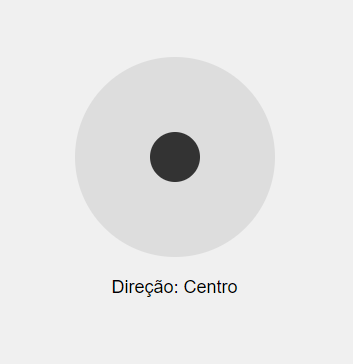

# Joystick-HTML

Este projeto cria um joystick virtual simples utilizando HTML, CSS e JavaScript, onde o usuário pode interagir com uma bolinha ("knob") que se move dentro de uma base circular. O código usa eventos de mouse para detectar o movimento e exibir a direção (Cima, Baixo, Esquerda, Direita ou Centro) com base na posição do joystick.

## Funcionalidades
- Movimento do Joystick: O usuário pode arrastar a bolinha do joystick dentro da base circular com o mouse.
Limitação de Movimento: A bolinha não ultrapassa os limites da base circular.
- Exibição da Direção: A direção do joystick é exibida em tempo real, com base na posição da bolinha (Cima, Baixo, Esquerda, Direita ou Centro).
- Reposicionamento ao Centro: Ao soltar o botão do mouse, a bolinha retorna automaticamente ao centro da base.

## Tecnologias Utilizadas
- HTML: Estrutura básica da página e dos elementos.
- CSS: Estilização da base e da bolinha, criando a aparência de um joystick.
- JavaScript: Lógica para movimentação, detecção de eventos de mouse e atualização da direção.

## Como Funciona
1. HTML: Define a estrutura da base do joystick e a bolinha ("knob").
2. CSS: Estiliza a base como um círculo e posiciona a bolinha no centro.
3. JavaScript:  
   - Detecta o clique e o movimento do mouse (mousedown, mousemove, mouseup).
   - Restringe a bolinha ao mover dentro da área da base.
   - Atualiza a direção exibida com base na posição da bolinha.
Reposiciona a bolinha ao centro quando o mouse é solto.

## Resultados
